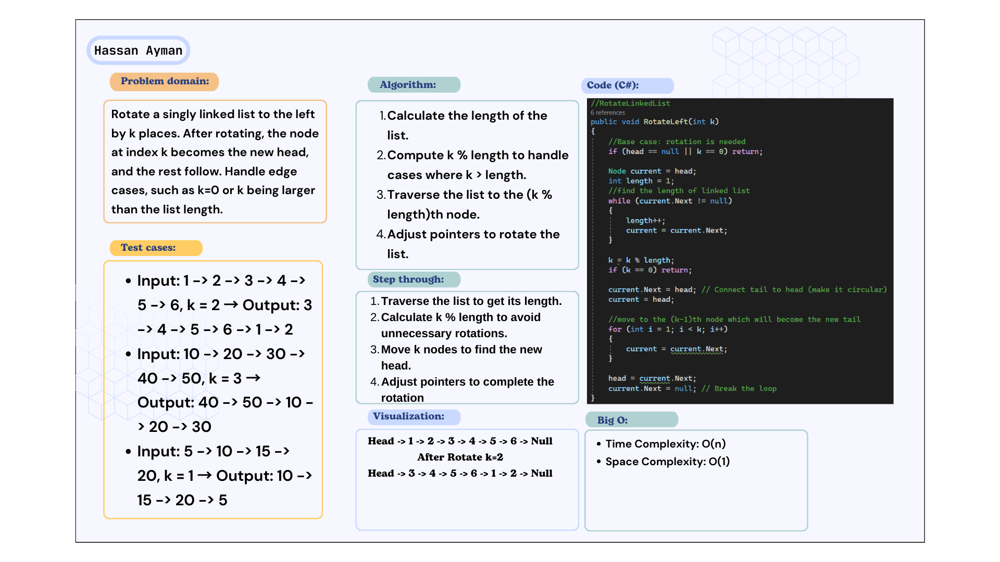
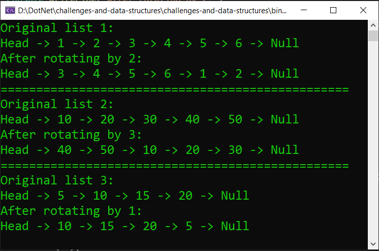

# Linked List - Rotate by K
### Rotate a singly linked list to the left by k places. After rotating, the node at index k becomes the new head, and the rest follow. Handle edge cases, such as k=0 or k being larger than the list length.

## Whiteboard image:

## Code run:
