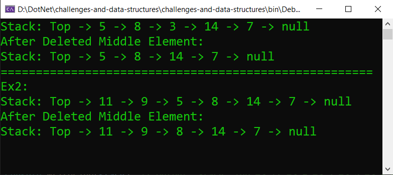

# Delete Middle Element of a Stack
### Implement a method to delete the middle element of a stack in C#. If the stack has an even number of elements, remove the lower middle element.

## Whiteboard image:

## Code run:

