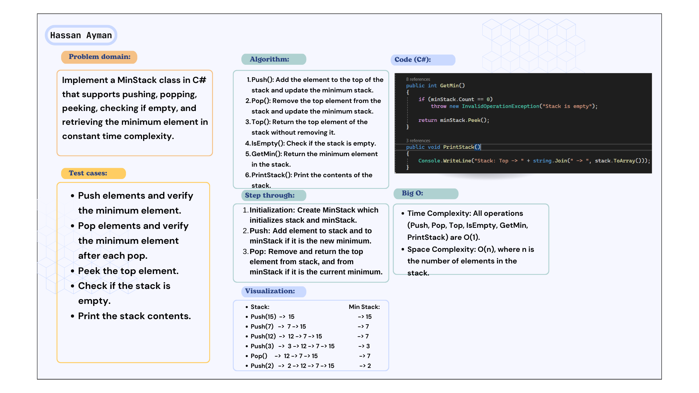
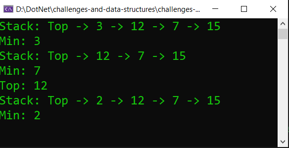

# Minimum Element in a Stack
### Implement a MinStack class in C# that supports pushing, popping, peeking, checking if empty, and retrieving the minimum element in constant time complexity.

## Whiteboard image:

## Code run:

