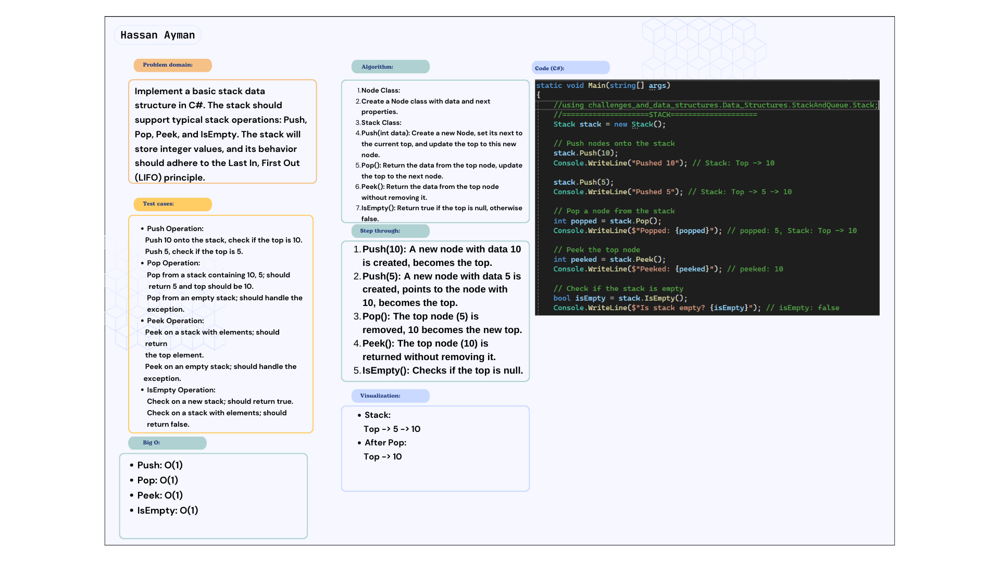
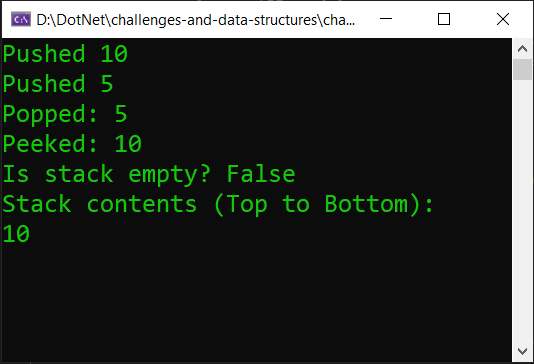

# Linked List Implementation
### Implement a basic stack data structure in C#. The stack should support typical stack operations: Push, Pop, Peek, and IsEmpty. The stack will store integer values, and its behavior should adhere to the Last In, First Out (LIFO) principle.

## Whiteboard image:

## Code run:

