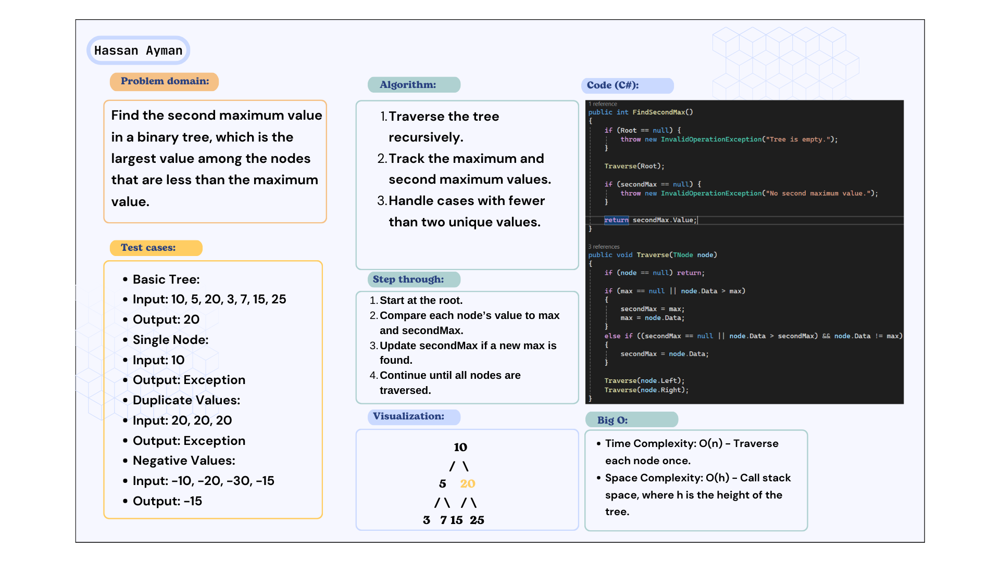
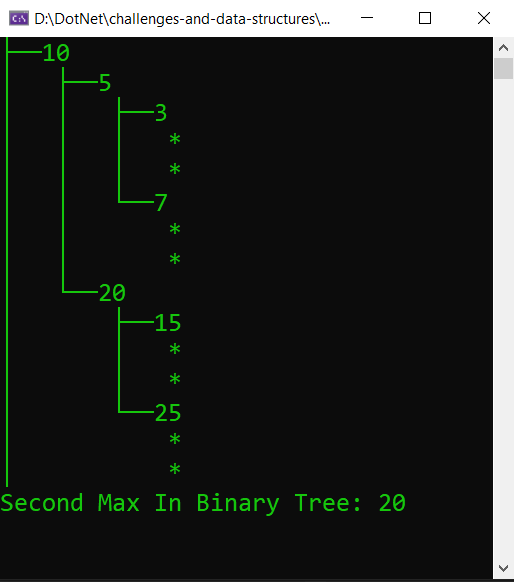

# Binary Tree - Second Maximum Value

Find the second maximum value in a binary tree, which is the largest value among the nodes that are less than the maximum value.

## Whiteboard:

## Code run:

