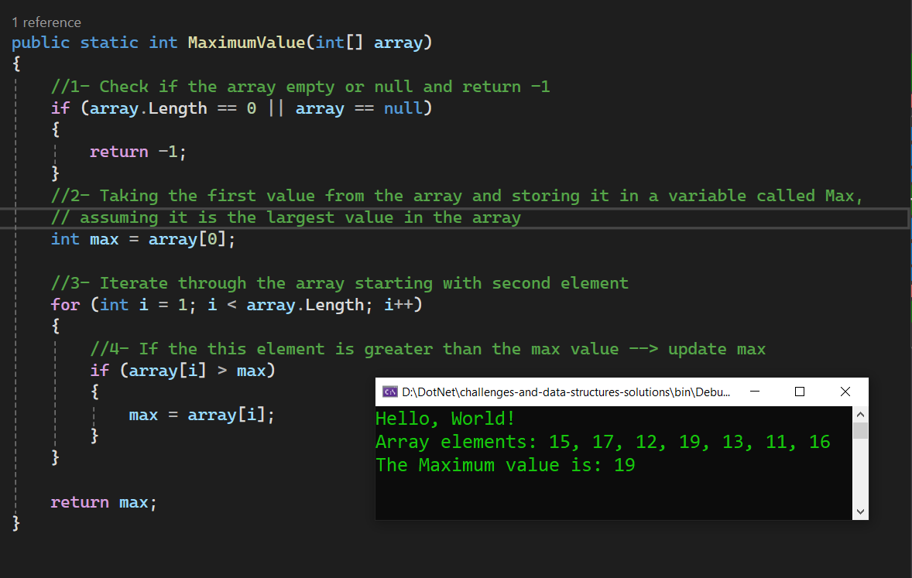

# Challenge 02: Maximum Value

### Write a function called MaximumValue that accepts an array of integers as its parameter. Without utilizing any of the built-in methods provided by the language, the function should return the maximum value in the array.

