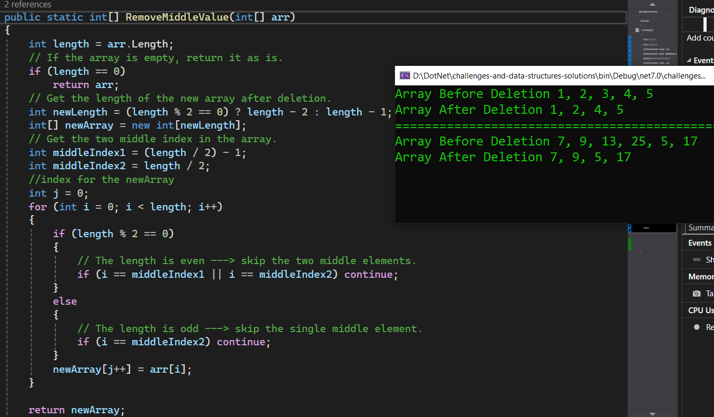

# Challenge 04: Insert Value in Middle of Array

### Write a function called RemoveMiddleValue that takes in an array as its parameter. Without utilizing any of the built-in methods available in the language, the function should remove the value at the middle index of the array if the array length is odd, or the middle two values if the array length is even, and return the modified array.

